# VPC Peering - Connecting Two VPCs

## Project Overview

This project represents Part 6 in my AWS VPC series - **connecting two separate VPCs using VPC Peering**! After mastering single VPC connectivity in Part 5, I expanded my skills by creating two isolated VPCs and establishing a peering connection between them. I learned how to configure route tables for cross-VPC communication, troubleshoot Elastic IP assignments, and validate the peering connection using ping tests between EC2 instances in different VPCs.

**AWS Region Used:** eu-west-3 (Paris)  
**Project Series:** Part 6 of NextWork VPC Challenge

---

## Table of Contents

- [What I Built](#what-i-built)
- [Technologies & Concepts](#technologies--concepts)
- [Step-by-Step Implementation](#step-by-step-implementation)
  - [Step 1: Set Up Two VPCs Using VPC Wizard](#step-1-set-up-two-vpcs-using-vpc-wizard)
  - [Step 2: Create VPC Peering Connection](#step-2-create-vpc-peering-connection)
  - [Step 3: Update Route Tables](#step-3-update-route-tables)
  - [Step 4: Launch EC2 Instances](#step-4-launch-ec2-instances)
  - [Step 5: Assign Elastic IP and Connect to Instance](#step-5-assign-elastic-ip-and-connect-to-instance)
  - [Step 6: Test VPC Peering with Ping](#step-6-test-vpc-peering-with-ping)
- [Cleanup](#cleanup)
- [Conclusion](#conclusion)
- [What's Next](#whats-next)

---

## What I Built

A complete VPC peering architecture connecting two isolated VPCs:

### **VPC Infrastructure:**

**Key Achievement**: Successfully established private communication between two separate VPCs without using the public internet!

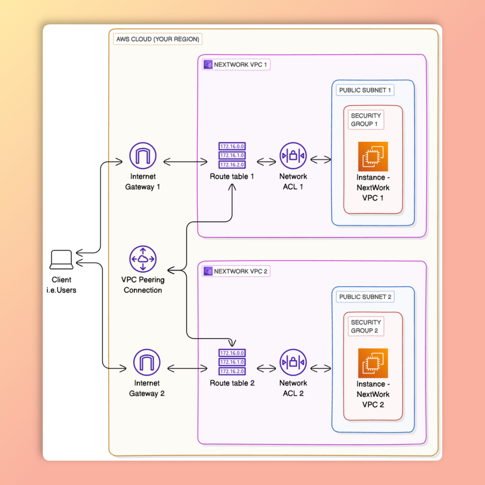

---

## Technologies & Concepts

### AWS Services Used

- **Amazon VPC** - Virtual Private Cloud for isolated networks
- **VPC Peering** - Direct connection between two VPCs
- **VPC Wizard** - Automated VPC creation tool
- **Amazon EC2** - Virtual servers for testing connectivity
- **Elastic IP** - Static IPv4 addresses for instances
- **Route Tables** - Direct traffic between VPCs via peering connection
- **Security Groups** - Instance-level firewall rules
- **EC2 Instance Connect** - Browser-based SSH access

---

## Step-by-Step Implementation

### Step 1: Set Up Two VPCs Using VPC Wizard

**What I did:**

I used the AWS VPC Wizard to rapidly create two complete VPCs with all necessary components.

#### Planning CIDR Blocks for Peering

**Critical Rule**: VPCs being peered **cannot have overlapping CIDR blocks**.

If both VPCs used `10.0.0.0/16`, the router couldn't determine whether traffic to `10.0.1.50` should go to VPC 1 or VPC 2 - causing routing conflicts.

**My Solution:**

```
VPC 1: 10.1.0.0/16
VPC 2: 10.2.0.0/16
```

**Memory Trick**: Match the second octet to the VPC number (VPC **1** → 10.**1**.0.0/16)

#### Creating NextWork VPC 1

**VPC Wizard Configuration:**

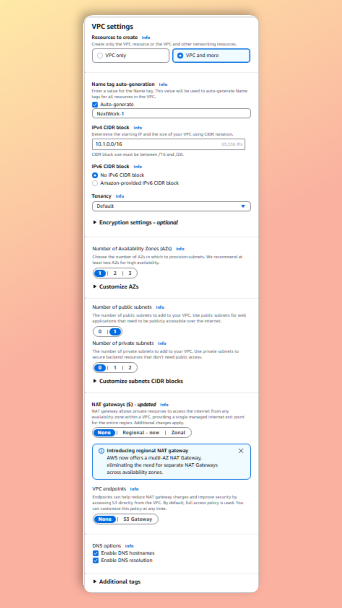

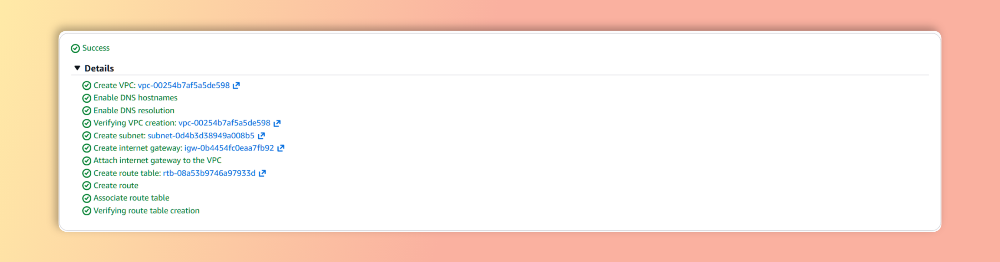

#### VPC 1 Resource Map

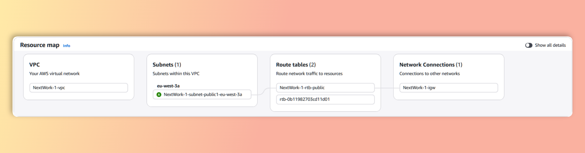

---

#### Creating NextWork VPC 2

**VPC Wizard Configuration:**

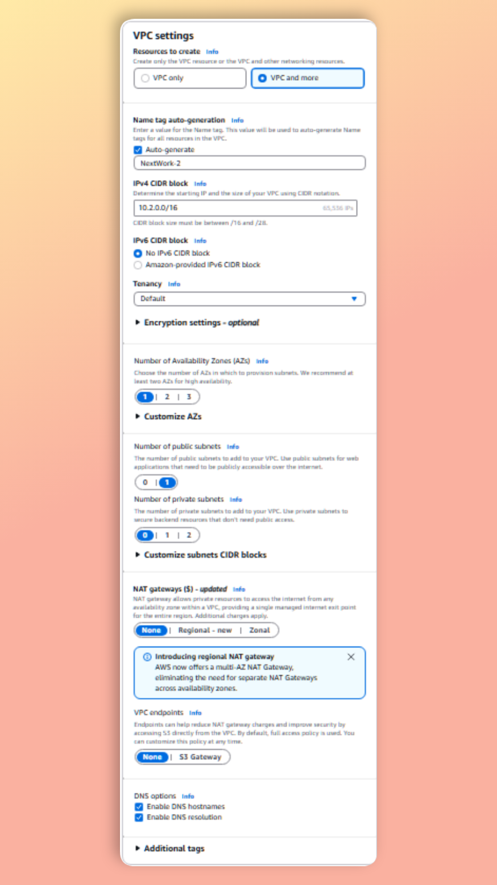

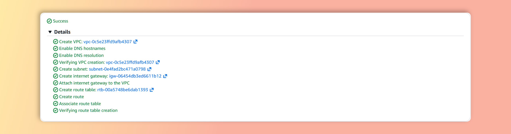

#### VPC 2 Resource Map

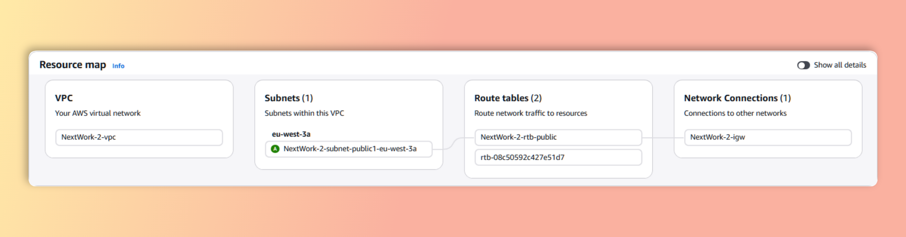

---

### Step 2: Create VPC Peering Connection

**What I did:**

I created a VPC peering connection to establish a private network link between the two VPCs.

#### Understanding VPC Peering

**What is VPC Peering?**

VPC Peering is a networking connection between two VPCs that enables traffic routing using **private IP addresses**, as if they were part of the same network.

**Without VPC Peering:**

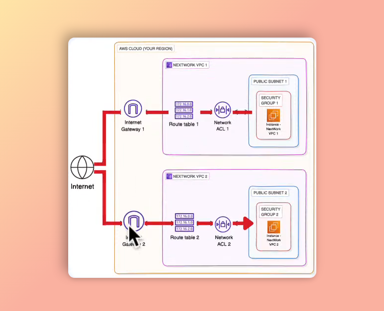

**With VPC Peering:**

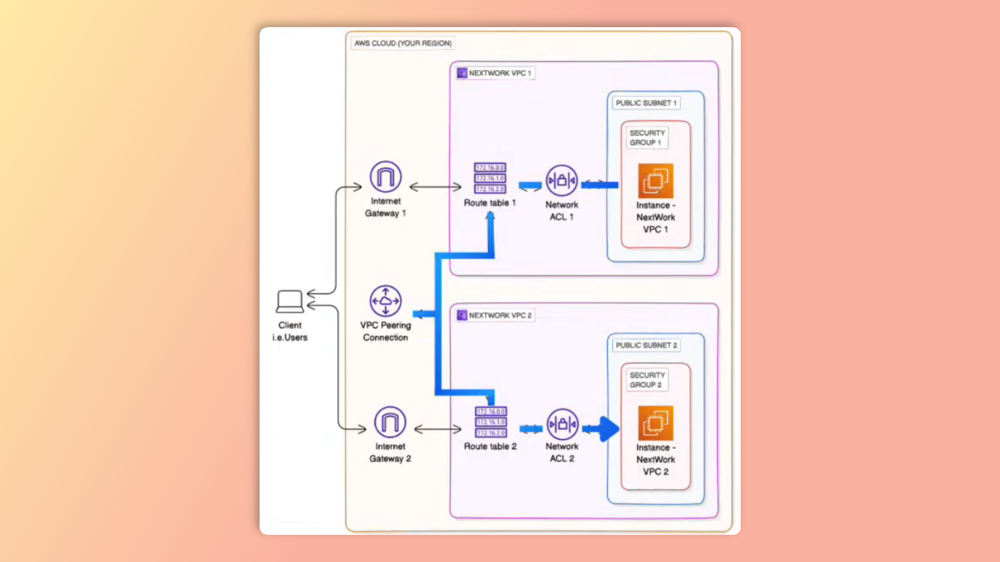

**Benefits:**

- **Security**: Traffic never traverses the public internet
- **Performance**: Lower latency, faster data transfer
- **Cost**: No data transfer charges between peered VPCs in same region
- **Simplicity**: No VPN or gateway infrastructure needed

#### Understanding Peering Terminology: Requester vs Accepter

**Requester (VPC 1):**

- The VPC that initiates the peering connection request
- Sends invitation to the accepter VPC

**Accepter (VPC 2):**

- The VPC that receives the peering connection request
- Can accept or reject the invitation
- Peering connection becomes active only after acceptance

**Important**: Both VPCs must agree to the peering connection. It's a mutual relationship!

#### Creating the Peering Connection

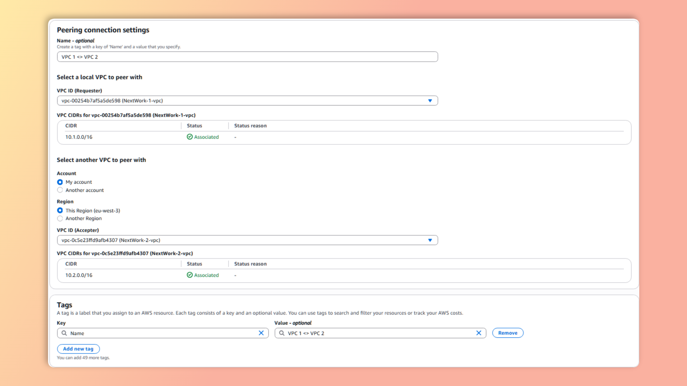

**Note**: You can also peer VPCs across different AWS accounts and regions!

#### Peering Connection Requested

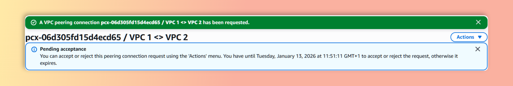

**Status**: Pending acceptance

**What this means:**

The peering connection is created but **not yet active**.

**Why is acceptance needed?**

This ensures both VPC owners agree to the connection. In cross-account scenarios, the accepter VPC owner must explicitly approve the peering request.

#### Accepting the Peering Request

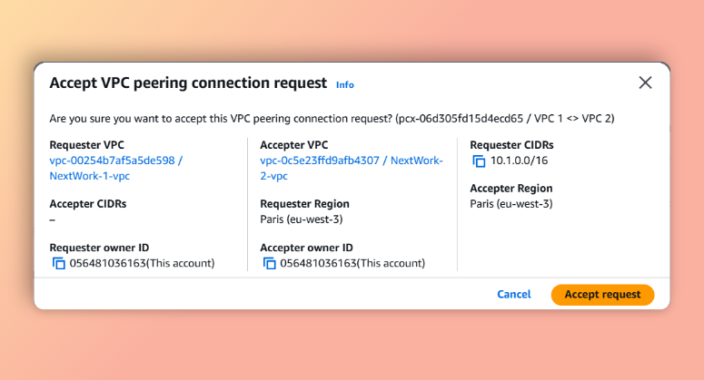

**Actions**: Actions → Accept request

Since I own both VPCs, I'm accepting on behalf of VPC 2 (the accepter).

#### Peering Connection Active

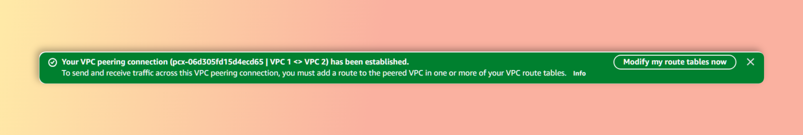

**Success!** The peering connection is now established. However, traffic still won't flow until we update the route tables!

---

### Step 3: Update Route Tables

**What I did:**

I updated both VPCs' route tables to direct traffic destined for the other VPC through the peering connection.

#### Understanding Route Tables for VPC Peering

**The Challenge:**

Even after creating a peering connection, traffic doesn't automatically know how to use it. Route tables must be updated to direct traffic through the peering connection.

#### Updating VPC 1 Route Table

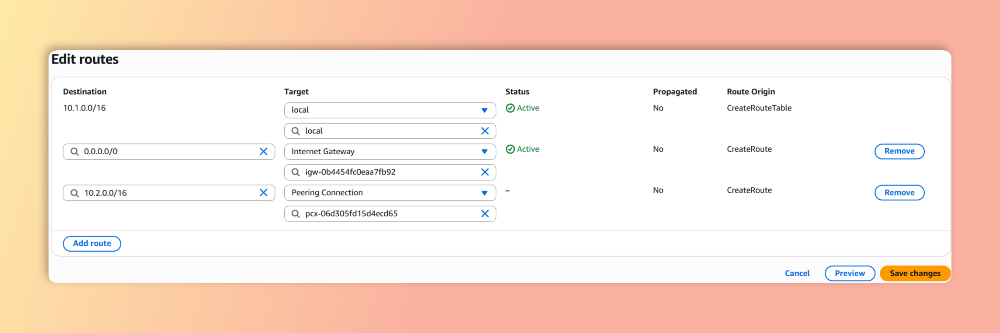

#### Common Mistake - Wrong CIDR Block

**What I did wrong**: I accidentally entered 10.1.0.0/16 (VPC 1's own CIDR) instead of 10.2.0.0/16!

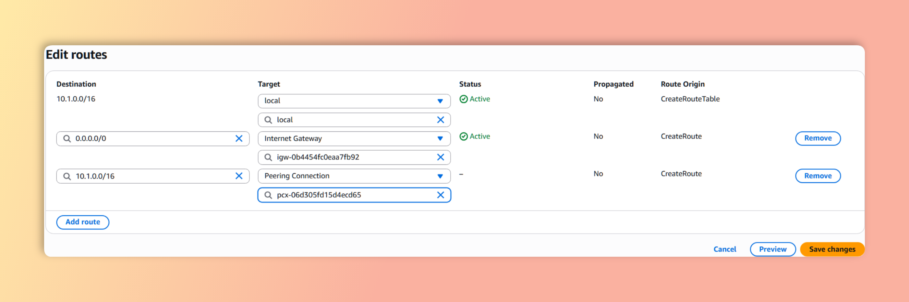

**Error**: "The destination CIDR block overlaps with existing subnet CIDR"


**Why this causes an error:**

The route table can't differentiate between local traffic and peered traffic if they have the same CIDR block. AWS prevents this misconfiguration.

**Fix**: Changed destination to 10.2.0.0/16 ✅

#### VPC 1 Routes Complete

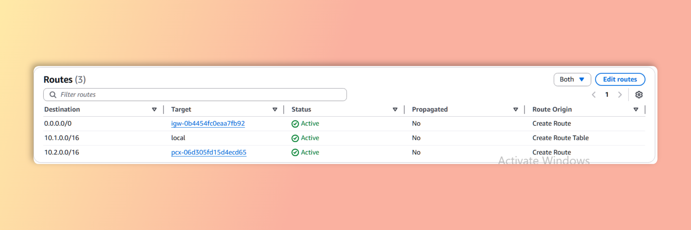

**Success!** VPC 1 now knows how to reach VPC 2.

---

#### Updating VPC 2 Route Table

**Challenge Yourself:**

I followed the same process for VPC 2's route table.

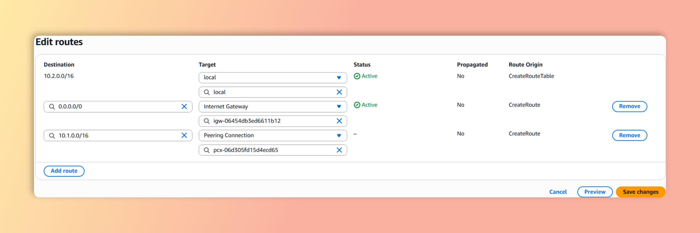

#### VPC 2 Routes Complete

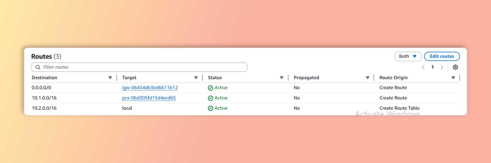

**Success!** VPC 2 now knows how to reach VPC 1.

**Peering is bidirectional!** Both route tables must have routes to each other.

---

### Step 4: Launch EC2 Instances

**What I did:**

I launched one EC2 instance in each VPC to test the peering connection.

#### Understanding Default Security Groups

**Important Discovery:**

When you create a VPC, AWS automatically creates a **default security group** with specific rules.

**Default Security Group Inbound Rules:**

```
Type        Protocol    Port    Source
All traffic    All       All     sg-xxxxx (itself)
```

**What this means:**

- Allows **all** traffic from resources using the **same security group**
- **Blocks** all traffic from outside the VPC
- **Blocks** SSH from EC2 Instance Connect (comes from internet)

This will become important when we try to connect to our instances!

#### Launching Instance in VPC 1

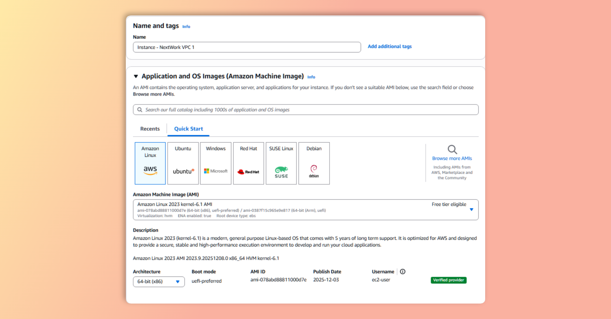
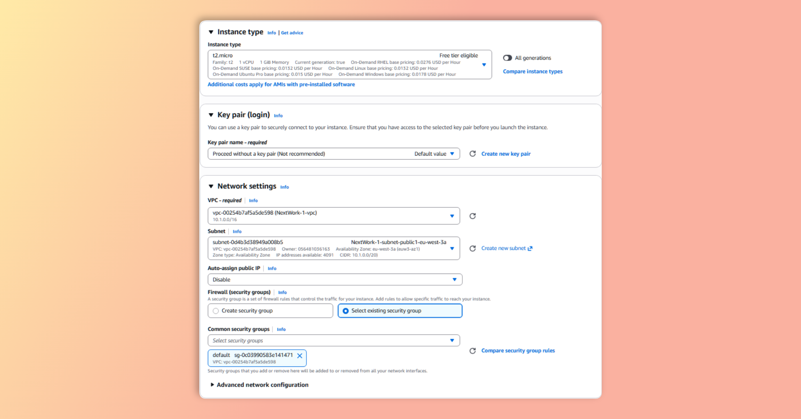
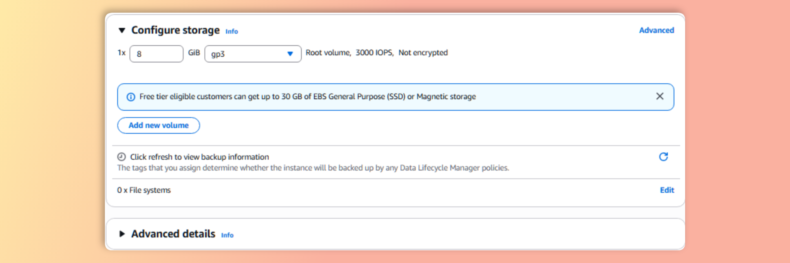

---

#### Launching Instance in VPC 2

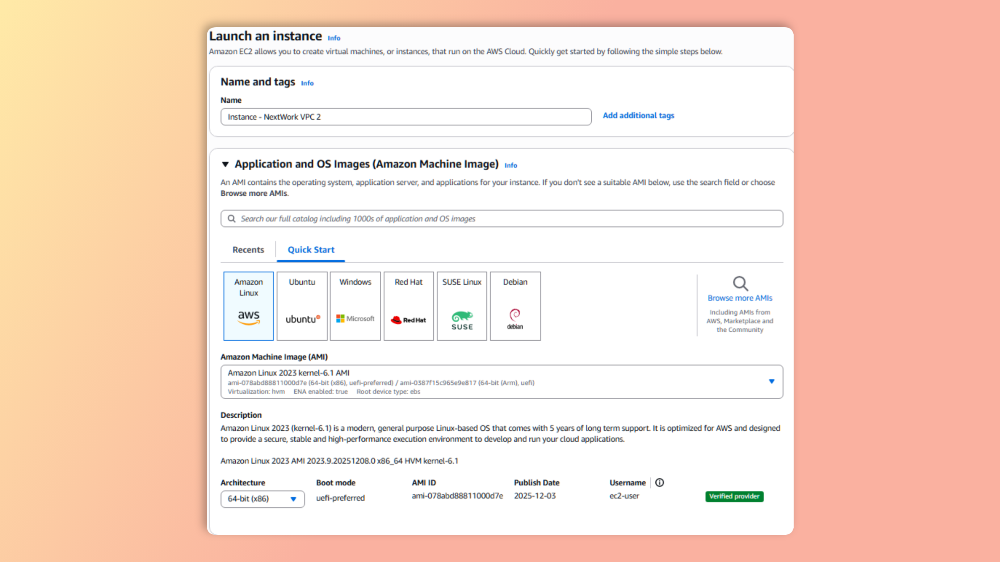
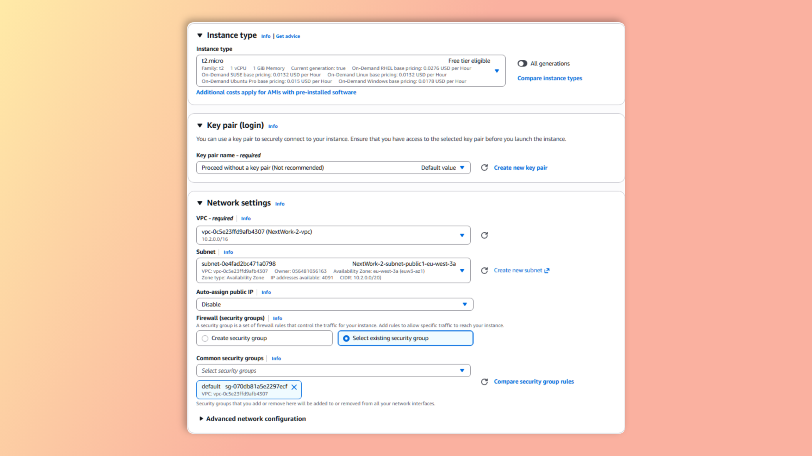
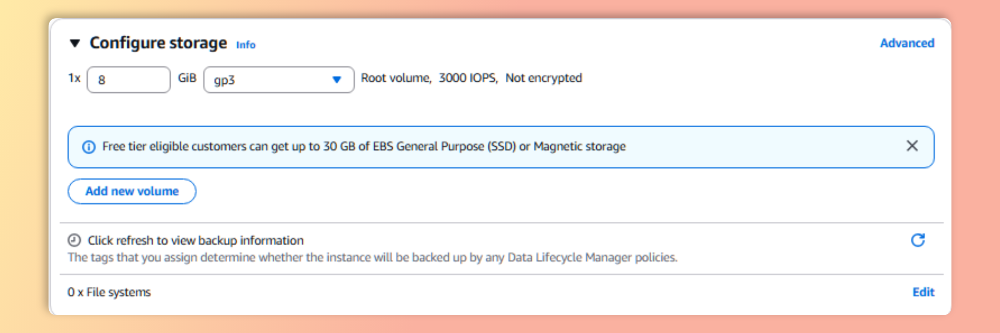

---

### Step 5: Assign Elastic IP and Connect to Instance

**What I did:**

I allocated an Elastic IP address and associated it with Instance 1 to enable EC2 Instance Connect access.

#### Understanding Elastic IP Addresses

**What are Elastic IPs?**

Elastic IPs are **static, public IPv4 addresses** that you can allocate to your AWS account and assign to EC2 instances.

**Regular Public IP vs Elastic IP:**

| Feature        | Regular Public IP                  | Elastic IP                                        |
| -------------- | ---------------------------------- | ------------------------------------------------- |
| **Assignment** | Automatic when instance launches   | Manual allocation                                 |
| **Behavior**   | Changes when instance stops/starts | Remains constant                                  |
| **Cost**       | Free                               | Free when attached, $0.005/hour when not attached |
| **Use Case**   | Temporary instances                | Production servers, DNS records                   |

**Why Elastic IPs Matter:**

**Scenario 1: E-commerce Website**

```
Without Elastic IP:
- Instance restarts → New public IP (54.123.45.67 → 18.234.56.78)
- DNS record (shop.example.com) still points to old IP
- Website is DOWN until DNS updates (can take hours!)

With Elastic IP:
- Instance restarts → Same Elastic IP (54.123.45.67)
- DNS record still correct
- Website stays UP! ✅
```

**My Use Case:**

I launched instances **without auto-assigned public IPs**, so they couldn't use EC2 Instance Connect. Elastic IPs provided a way to assign public IPs **after launch**.

#### Problem: EC2 Instance Connect Requires Public IP

**Initial Connection Attempt:**

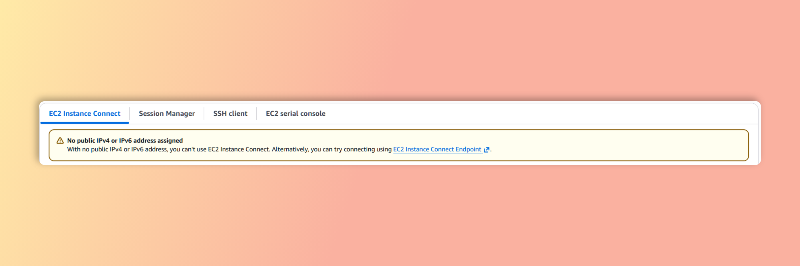

**Why this happened:**

I disabled auto-assign public IP when launching the instance. EC2 Instance Connect requires a public IP because it connects **over the internet** by default.

**Verification:**

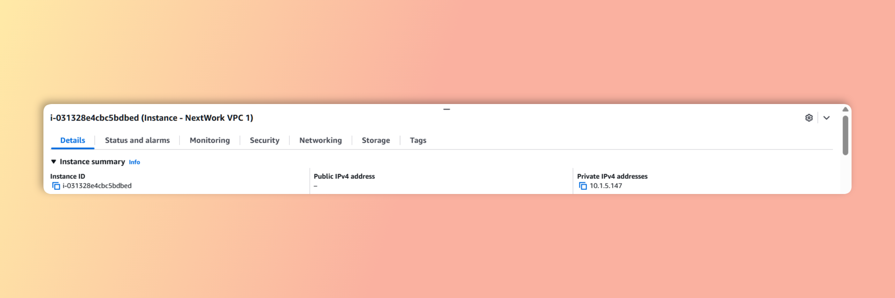

---

#### Allocating an Elastic IP

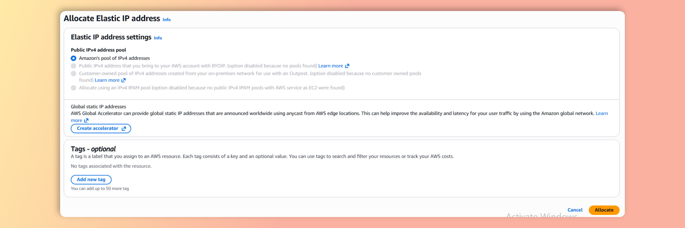

**What happens:**

AWS allocates a static IPv4 address from Amazon's pool and assigns it to my account.

---

#### Associating Elastic IP with Instance

**Actions**:

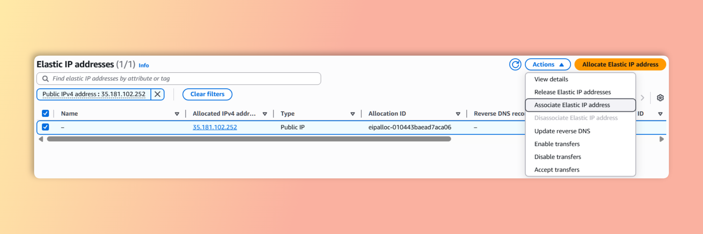

**Configuration:**
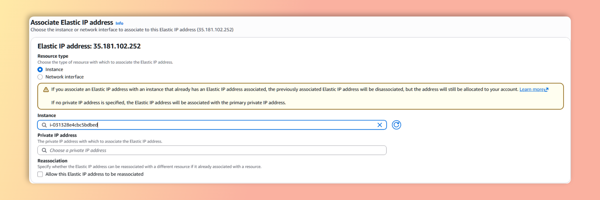

**What this does:**

Attaches the Elastic IP to the instance's network interface, giving it a public IP address.

#### Elastic IP Associated

**Verification:**

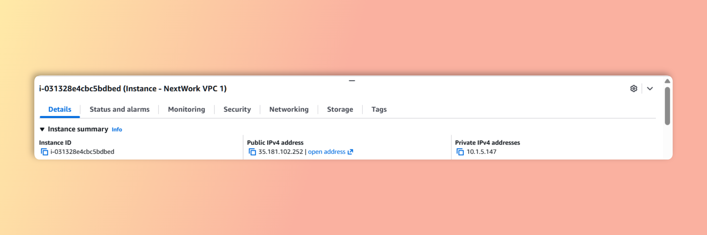

---

#### Problem: SSH Connection Still Fails

**Second Connection Attempt:**


#### Troubleshooting Security Group

**Investigation Steps:**

1. ✅ Check Route Table → Has route to Internet Gateway
2. ✅ Check Network ACL → Allows all traffic
3. ⚠️ Check Security Group → **Found the issue!**

**Root Cause:**

## The default security group **only allows traffic from resources using the same security group**. EC2 Instance Connect connects from the **internet**, which is blocked!

#### Fixing the Security Group

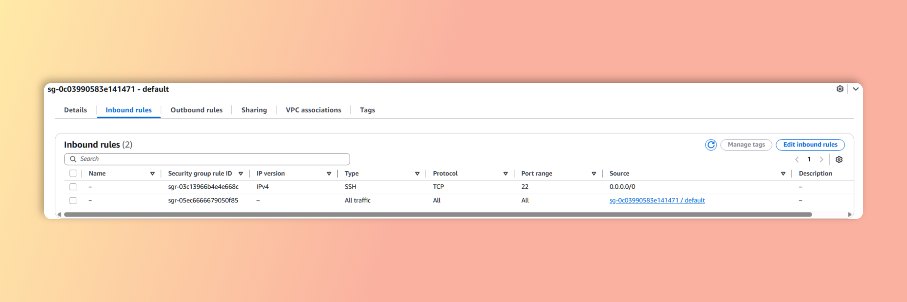

---

#### Successful Connection

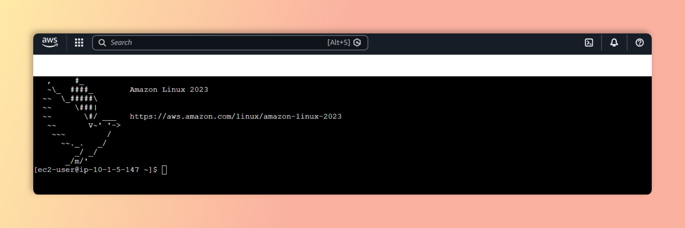

---

### Step 6: Test VPC Peering with Ping

**What I did:**

I tested the VPC peering connection by pinging Instance 2 (VPC 2) from Instance 1 (VPC 1).

#### Initial Ping Test

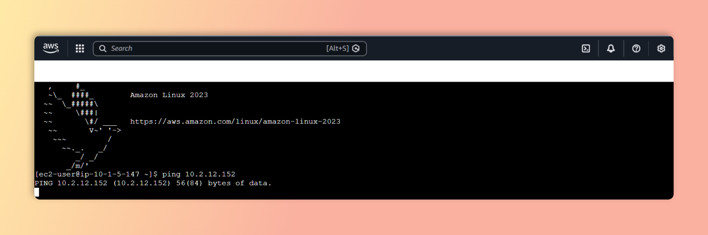

---

#### Troubleshooting Security Group

**Root Cause Found!**

The default security group only allows traffic from resources with the **same security group**. Instance 1 has a **different security group** (from VPC 1), so its ping is blocked!

---

#### Adding ICMP Rule to VPC 2 Security Group

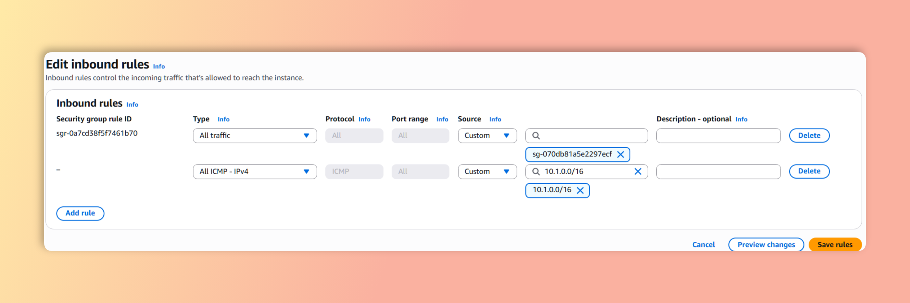

---

#### Successful Ping Test

**Terminal output:**

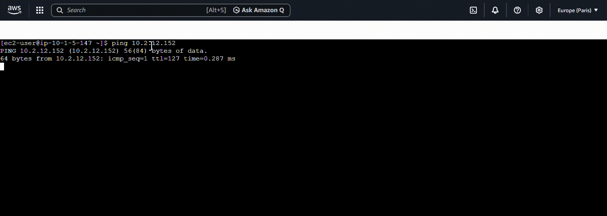

---

## Cleanup

**Important**: Delete resources in the correct order to avoid dependency errors!

1. **Release Elastic IP addresses** (or they'll keep charging you!)
2. **Terminate EC2 instances**
3. **Delete VPC peering connection**
4. **Delete VPC 1** (cascade deletes subnets, route tables, IGW, NACLs, security groups)
5. **Delete VPC 2** (cascade deletes all associated resources)

---

## Conclusion

This project was a major leap forward - I went from managing a single VPC to **connecting two separate VPCs** and enabling private communication between them!

**Key Takeaways:**

1. ✅ **Mastered VPC Peering** - Connected two isolated VPCs using a peering connection for private communication
2. ✅ **Understood CIDR planning** - Ensured non-overlapping CIDR blocks (10.1.0.0/16 vs 10.2.0.0/16) to avoid routing conflicts
3. ✅ **Configured bidirectional routes** - Added routes in both VPCs pointing to each other via peering connection
4. ✅ **Learned Elastic IPs** - Allocated and associated static public IP addresses for EC2 Instance Connect
5. ✅ **Troubleshot default security groups** - Discovered they only allow traffic from same SG, had to add SSH and ICMP rules
6. ✅ **Tested cross-VPC connectivity** - Used ping to validate instances in different VPCs can communicate via private IPs
7. ✅ **Used VPC Wizard efficiently** - Created two complete VPCs in minutes with auto-generated resources

---

## What's Next?

This project is **Part 6** of the NextWork VPC series. In the next projects, I'll explore:

**Part 7: VPC Monitoring with Flow Logs**

- Capture detailed network traffic logs
- Analyze communication patterns between VPCs
- Debug connectivity issues with packet-level data
- Monitor security threats and unusual traffic
- Use CloudWatch Logs for centralized log analysis

---

**Project Completed:** January 2026  
**Author:** YOUHAD AYOUB  
**Region:** eu-west-3 (Paris)  
**NextWork Challenge:** AWS Beginners Challenge - Project 7
